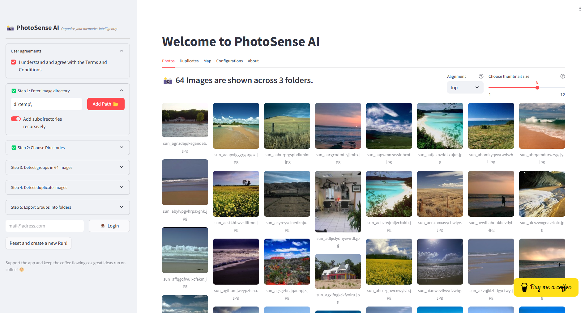
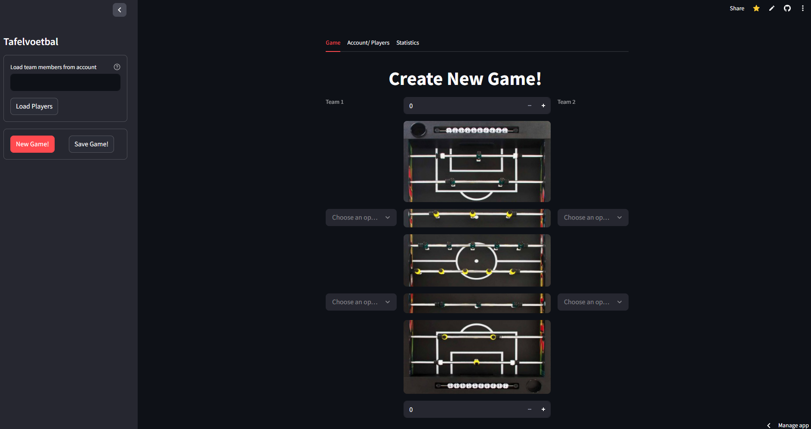

<section id="table-of-contents" class="toc">
  <header>
    <h3>Overview</h3>
  </header>

*  Auto generated table of contents
{:toc}

</section><!-- /#table-of-contents -->

All my software projectes are listed on my [github page](https://github.com/erdogant).
 
My applications are available with the links below.

---

## SkyWalk
[Skywalk](https://skywalk.streamlit.app/), {: style="width: 100px;" }
**The Tool For Flight Preparations.**, [Medium](https://erdogant.medium.com/skywalk-the-tool-for-flight-preparations-51c52d5a1ac0), Aug. 2024

  

    
  

 
---
 

## PhotoSense-AI
[PhotoSense-AI](https://github.com/erdogant/PhotoSenseAI/), **The Tool For Organizing Your Photo Library Locally.**, [Documentation Pages](https://erdogant.github.io/PhotoSenseAI)

  

    
  

 
---
 

## Tafelvoetbal
[Tafelvoetbal](https://voetbal.streamlit.app/), **A dashboard to keep track of the scores!**

    

      
    

